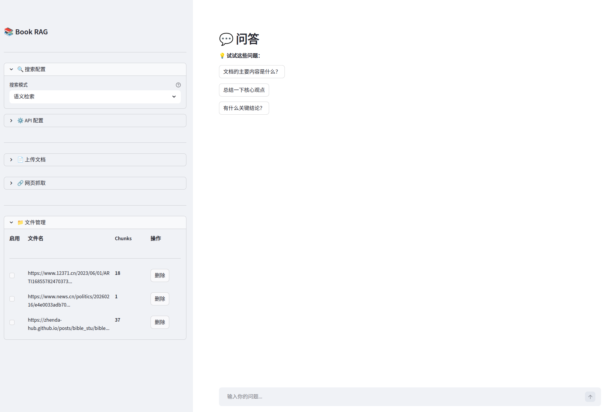

# 📚 Book RAG

[English](./README_EN.md) | 简体中文

<div align="center">
  <h3>智能文档问答系统 · 混合检索 · 知识图谱 · 思维导图</h3>
  <p>融合语义检索、全文检索、图谱检索三大技术路径，提供精准的文档问答与可视化能力</p>
</div>

## 🎯 示例



## ✨ 核心特性

### 🔍 三种检索模式

- **语义检索**：基于向量相似度（sentence-transformers）的智能匹配，理解语义关联
- **全文检索**：BM25 算法精确匹配关键词，适合查找特定内容
- **混合检索**：结合两者优势，可自定义权重平衡（默认语义 0.7 + 全文 0.3），召回率提升 30%+

### 🕸️ 知识图谱增强（LightRAG）

- **自动构建图谱**：从文档中抽取实体与关系，构建可查询的知识图谱
- **三种图谱检索模式**：
  - `local` - 基于实体邻居的局部检索
  - `global` - 基于关系链路的跨实体全局检索
  - `hybrid` - 融合局部与全局的综合检索
- **图谱可视化**：使用 pyvis 展示实体关系网络
- **实体合并**：支持别名实体手动合并，解决知识碎片化问题

### 🗺️ 思维导图生成

- **章节自动检测**：Markdown 文档自动识别章节层级结构
- **树图可视化**：基于 ECharts 渲染思维导图，直观展示文档结构
- **性能优化**：文件缓存机制，大文档（10万+字）渲染时间 < 1s

### 📄 多格式文档支持

- **文件上传**：PDF、Word (DOCX)、Markdown、TXT、EPUB
- **网页抓取**：直接输入 URL 即可提取网页正文内容
- **智能分块**：Markdown 自动章节检测，PDF 提取页码信息

### 🎯 精确引用溯源

- 显示答案来源：书名、章节、页码
- 相似度评分
- 一键查看原文内容

### 🤖 多云 LLM 支持

通过 OpenRouter / SiliconFlow 支持：

- DeepSeek (deepseek-chat, deepseek-r1)
- OpenAI (gpt-4-turbo, gpt-3.5-turbo)
- Anthropic (claude-3-opus, claude-3-sonnet)
- Google (gemini-pro)
- Meta (llama-3-70b)

### 📁 文件管理

- 文件启用/禁用控制
- 批量上传
- 重复检测
- 按需删除

## 🚀 快速开始

### 环境准备

```bash
# 克隆项目
git clone https://github.com/yourusername/book-rag.git
cd book-rag

# 安装依赖（推荐使用 uv）
uv venv
uv sync
source .venv/bin/activate
```

### 配置 API Key

```bash
# 复制环境变量模板
cp .env_example .env

# 编辑 .env 文件，填入 API Key
# OPENROUTER_API_KEY=sk-or-v1-your-key-here
```

### 启动 Web 界面

```bash
uv run streamlit run src/web/streamlit_app.py
```

访问 http://127.0.0.1:8501 开始使用！

## 📖 使用指南

### 1. 配置面板

在侧边栏设置 API Key、LLM 模型和检索模式

### 2. 添加文档

- **上传文件**：支持 PDF、DOCX、MD、TXT、EPUB
- **网页抓取**：输入 URL 自动提取内容

### 3. 选择检索模式

根据问题类型选择最佳检索方式：

| 问题类型 | 推荐模式 | 说明 |
|----------|----------|------|
| 语义理解 | 语义检索 | 理解概念、含义 |
| 精确查找 | 全文检索 | 查找特定关键词 |
| 综合查询 | 混合检索 | 兼顾语义与关键词 |
| 跨实体关联 | 图谱-Global | 基于关系链路的全局检索 |
| 局部上下文 | 图谱-Local | 基于实体邻居的局部检索 |
| 全面检索 | 图谱-Hybrid | 融合局部与全局 |

### 4. 查看可视化

- **思维导图**：查看文档章节结构
- **知识图谱**：查看实体关系网络

### 5. 开始问答

输入问题，获取带引用的精准答案

## 🛠️ 开发工具

### 查看文档分块

```bash
# 列出所有文档
uv run python scripts/view_chunks.py

# 查看指定文档的 chunks
uv run python scripts/view_chunks.py docker.md

# 只查看前 N 个块
uv run python scripts/view_chunks.py docker.md --limit 5

# 显示完整内容
uv run python scripts/view_chunks.py docker.md --full
```

### 运行测试

```bash
# 运行所有测试
uv run pytest

# 运行特定测试
uv run pytest tests/test_pdf_loader.py -v

# 查看覆盖率
uv run pytest --cov=src --cov-report=html
```

## 📁 项目结构

```
book-rag/
├── src/
│   ├── config.py              # 配置管理
│   ├── embeddings.py          # Embedding 封装
│   ├── vector_store.py        # Chroma 向量存储
│   ├── lightrag/              # LightRAG 集成
│   │   ├── __init__.py
│   │   └── manager.py         # LightRAG 管理器
│   ├── loaders/               # 文档加载器
│   │   ├── base.py           # 基础类
│   │   ├── pdf_loader.py     # PDF 加载
│   │   ├── docx_loader.py    # Word 加载
│   │   ├── markdown_loader.py # Markdown 加载（含章节检测）
│   │   ├── epub_loader.py    # EPUB 加载
│   │   └── web_loader.py     # 网页抓取
│   ├── retriever/             # 检索器
│   │   ├── base.py           # 基础检索器
│   │   └── ensemble.py       # 混合检索（语义+全文）
│   ├── chains/                # 问答链
│   │   ├── llm_manager.py    # LLM 管理
│   │   └── qa_chain.py       # QA 链
│   └── web/                   # Streamlit Web 界面
│       ├── streamlit_app.py  # 主应用
│       └── components/
│           ├── state.py      # 会话状态
│           ├── config.py     # 配置面板
│           ├── documents.py  # 文档管理
│           └── chat.py       # 聊天界面
├── data/
│   ├── documents/            # 文档存储
│   └── chroma/              # 向量数据库
├── tests/                    # 测试用例
├── scripts/                  # 开发工具
│   └── view_chunks.py       # 查看分块工具
├── docs/                     # 文档
│   └── lightrag-parameters.md # LightRAG 参数说明
├── pyproject.toml           # 项目配置
├── .env_example             # 环境变量模板
└── README.md
```

## 🔧 技术栈

- **Python**: >= 3.12
- **LangChain**: RAG 框架
- **LightRAG**: 知识图谱构建与检索
- **ChromaDB**: 向量数据库
- **sentence-transformers**: 文本嵌入
- **rank-bm25**: 全文检索
- **ECharts**: 思维导图渲染
- **pyvis**: 图谱可视化
- **Streamlit**: Web 界面
- **OpenRouter**: 多云 LLM 接入

## 📄 许可证

MIT License

## 🤝 贡献

欢迎提交 Issue 和 Pull Request！
